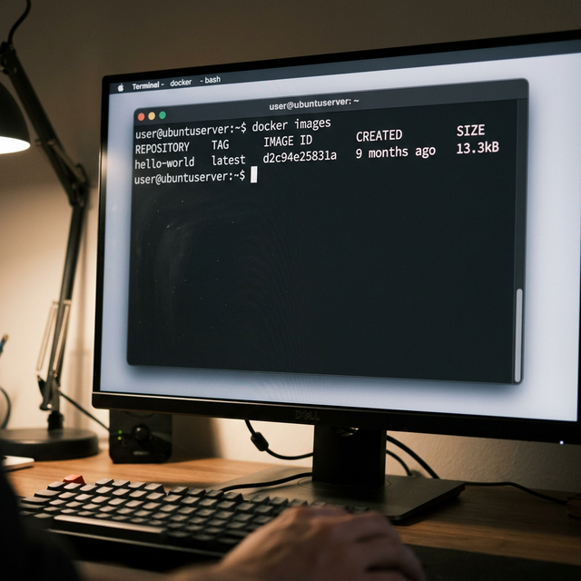
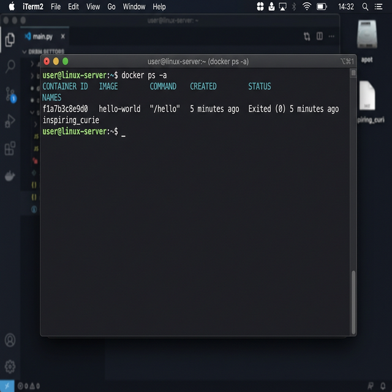

# Day 1 - Running First Docker Container

## Objective
Understand how Docker images and containers work by running the hello-world image.

## Step 1: Pull the image
Command:
```bash
docker pull hello-world
```
This command downloads the hello-world image from Docker Hub to the local machine.

## Step 2: Run the container
```bash
docker run hello-world
```
Output message confirms that Docker is correctly installed and running.

## What Happens Internally
- Docker checks if the image exists locally.
- If not, it pulls it from Docker Hub.
- Docker creates a container from the image.
- The container runs a small program.
- The program prints a message and exits.

## Key Concepts Learned
- **Image**: A read-only template used to create containers.
- **Container**: A running instance of an image.
- **Docker Hub**: A public registry where Docker images are stored.

## Commands Practiced
- `docker pull hello-world`
- `docker run hello-world`
- `docker images`
- `docker ps -a`

## Output Observation
The container runs once, prints a message, and then stops.

## Next Steps
- Understand Docker images vs containers
- Learn how to build a custom Docker image
- Write a simple Dockerfile

## Screenshots

### Docker Images


### Docker Containers


## 5 More Things You Can Do With the Hello-World Image

1. **Inspect the Image**: `docker inspect hello-world`
   Provides detailed JSON output containing configuration and metadata about the image.
2. **Remove the Container**: `docker rm <container_id>`
   Cleans up the stopped container from your system.
3. **Remove the Image**: `docker rmi hello-world`
   Deletes the downloaded image to save space.
4. **Run in Background (Detached)**: `docker run -d hello-world`
   Runs the container in the background and prints the new container ID.
5. **Name the Container**: `docker run --name my-hello-world hello-world`
   Assigns a custom, memorable name to the container instead of a random one.
